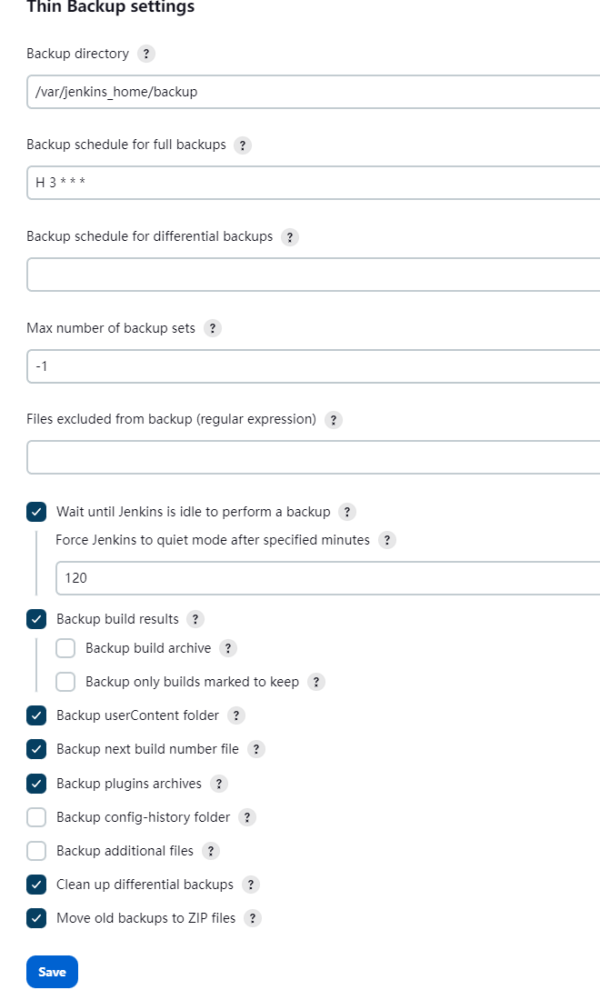

# jenkins 
docker run -d --name my_jenkins -u root -p 8085:8080 -p 50000:50000 -v /data/jenkins_home:/var/jenkins_home -v /etc/localtime:/etc/localtime -e JAVA_OPTS=-Duser.timezone=Asia/Shanghai --restart=always docker.io/jenkins/jenkins:2.319

docker run -d --name jenkins -u root -p 8083:8080 -p 50000:50000 -v /opt/jenkins:/var/jenkins_home -v /etc/localtime:/etc/localtime -e JAVA_OPTS=-Duser.timezone=Asia/Shanghai --restart=always --privileged docker.io/jenkins/jenkins:2.346.2

docker run -d --name jenkins -u root -p 8083:8080 -p 50000:50000 -v /opt/jenkins:/var/jenkins_home -v /etc/localtime:/etc/localtime -e JAVA_OPTS=-Duser.timezone=Asia/Shanghai --restart=always --privileged docker.io/jenkins/jenkins

## jenkins权限设置
1. 插件为Role-based Authorization Strategy
2. 全局安全设置使用Role-based Authorization Strategy并重启后会在系统设置-安全出现“Manage and Assign Roles”
3. 配置角色&分配角色给group或user
   * 全局角色
   * item角色： Pattern所填的内容是正则匹配 test1.*表示以test1开头的项目，test.*|Test.*表示以test或Test开头的项目

## maven构建
1. 插件安装
2. maven安装
3. jdk通过官网压缩包下载后放到/data/jenkins_home/java/ 并配置  （建议配置的mvn setting并配置阿里云镜像）
4. 建立maven任务并执行（不需要mvn开头）

### maven settings
1. 安装插件Config File Provider Plugin
2. 系统管理-》“Managed files”-》“Add a new Config” -》选择maven settings.xml  -》点击submit -》在Content中添加自己的settings.xml内容 -》点击提交。
3. 配置全局工具配置中使用File Provider
4. 配置任务中mvn-》高级-》

#### 超时设置
1. 任务-》构建环境-》Abort the build if it's stuck

#### 定时构建
* H 4 * * *

## 备份插件
* ThinBackup
* 

##### jenkins 2.282+Publish over ssh 1.22版本发布日志不能实时显示
问题解决了。作个记录，最新的 [Publish Over SSH]插件1.22版本，jenkins 282版本。
1. ssh server 的Verbose output in console要开启
2. Transfers 的Exec in pty要开启
   然后就是久违的实时日志显示了。