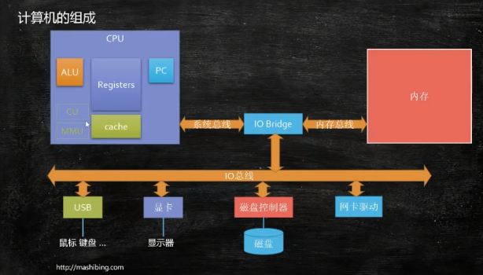

# 计算机组成

* CPU
* 内存
* 外围设备（鼠标、键盘、显卡、显示器、磁盘）
* IO Bridge 链接CPU和内存和IO总线
* IO总线 链接外围设备和IO Bridge
## 程序
    
## 进程
    进程是资源分配的基本单位（程序执行需要放入内存中的指令和数据）
## 线程
    线程是程序执行的基本单位
## CPU
    读指令->PC;读数据->Register;计算->ALU;回写;跳转下一条指令;
* Registers 寄存器
* PC  Program Counter 程序计数器
* ALU 数学逻辑单元（计算器）
* Cache 缓存（线程执行切换后保留前一个线程的寄存数据）
##### CPU如何执行一个线程
    (1) a = 2 + 3 ;
    (2) b = a + 5 ;
    1. 将2和3放入Registers中；
    2. ALU计算；将结果写回到a的地址；
    3. PC记录当前线程执行的命令在第（1）行，指向内存地址的指针；
##### 操作系统
    程序（APP）是可以直接操作硬件的，但是直接操作硬件很容易出错；
    为了管理APP诞生了一个东西叫Operating System（操作系统）；
    操作系统会帮我们管理APP中的线程（用户线程）；
    JVM就是一个APP；
##### 线程调度策略
    当前CPU该执行哪个线程，执行多长时间；
    完全公平的线程调度；操作系统不会让某个线程一直执行或一直等待；每个线程都执行一会儿；
    APP中的线程执行是需要操作系统来决定的；
##### 线程切换
    线程调度会涉及到线程的切换；
    线程切换的时候需要保存现场(CPU的Cache中)；
    保存现场：T1执行到哪里了，有些什么数据；
    线程切换 = CPU保存现场 -> 执行新线程 -> 恢复现场 -> 继续执行原线程；
* 引申问题： 一个单线程改成多线程以加快执行速度，是不是线程越多越好？是不是线程数与执行效率成线性增长？
    线程数有一个合适的数量，如果特别多的话，会将时间都浪费在线程切换上。
##### 用户线程和内核线程 
    用户线程（APP线程）和内核线程不一定是一一对应的。
    JVM的线程和内核线程是一一对应的。
    GO语言中的线程对应多个内核线程（协程）。 
