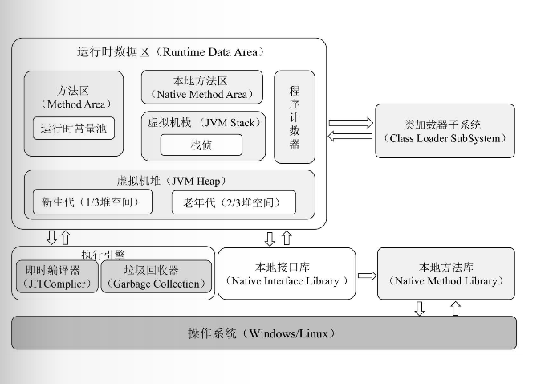

# JVM

* ClassFiles -> ClassLoader 类装载器
* Runtime Data Area 运行时数据区
    * Method Area 方法区（存储常量、静态变量、类信息、即时编译器编译后的机器码、运行时常量池）
    * Heap 堆
    * Java stack java栈
    * Native Method Stack 本地方法栈
    * Program Counter Register 程序计数器
* Execution Engine 执行引擎（即时编译器&垃圾回收器）
* Native Interface 本地方法接口（用于调用操作系统的本地方法库完成具体的指令操作）
* 本地方法库




### ClassLoader:
    负责加载class文件。
    class文件在文件开头有特定的文件标示。
    ClassLoader将class文件字节码内容加载到内存中，并将这些内容转换方法区中的运行时数据结构。
    ClassLoader只负责class文件的加载，至于它是否可以运行，则由Execution Engine决定。

#### 虚拟机自带的加载器 ClassLoader
* 启动类加载器 Bootstrap C++ /jre/lib/rt.jar
* 扩展类加载器 Extension/Ext Java /jre/lib/ext/*.jar
* 应用程序类加载器 App Java也叫 系统类加载器，加载当前应用的classpath的所有类
#### 用户自定义加载器 
#### sun.misc.Launcher 是java虚拟机的入口 
#### 双亲委派机制 是类的加载机制的重要体现
* 自顶向下加载： 从最上层开始找 bootstrap -> extension -> app 
* 沙箱安全机制:  保证java源代码不受污染，保证了使用不同的类加载器最终得到的都是同一个对象（包名类名相同的一定是同一个对象），不会拿到自定义的 java.lang.String
#### 如何打破双亲委派机制
* 继承ClassLoader，并重写loadClass
* 使用Thread的ContextClassLoader

## Execution Engine：
    执行引擎负责解释命令，提交操作系统执行。
    
## Native:
    Native标识的本地方法调用Navtive Interface（本地方法接口）调用Native Method Stack（本地方法栈）调底层第三方（C语言）的函数库（不同操作系统函数库不同）

## Program Counter Register : PC寄存器/程序寄存器 （指针/排班表）
    每个线程都有一个程序计数器，是线程私有的，就是一个指针。
    指向方法区中的方法字节码（用来存储指向下一条指令的地址，也即将要执行的指令代码），由执行引擎读取下一条指令，是一个非常小的内存空间，忽略不计。
    这块内存区域很小，它是当前线程所执行的字节码的行号指示器，字节码解释器通过改变这个计数器的值来选取下一条需要执行的字节码指令。
    如果执行的是一个native方法，那这个计数器是空的。
    用以完成分支、循环、跳转、异常处理、线程恢复等基础功能。不会发生内存溢出（OOM）错误。

## Method Area
    方法区是供各线程共享的运行时内存区域，存储的是类的结构信息（模板），
    例如：运行时常量池（Runtime Constant Pool）、字段和方法数据、构造函数和普通方法的字节码内容。
    上面讲的是规范，在不同虚拟机里头实现是不一样的，最典型的就是永久代(PermGen Space)和元空间(Metaspace)
    实例变量存在堆内存中，和方法区无关！
    
## Heap & Stack
    栈管运行 堆管存储
### Stack
    栈也叫栈内存，主管Java程序的运行，是在线程创建时创建，它的生命周期是跟随线程的生命周期，线程结束栈内存也就释放。
    对于栈来说不存在垃圾回收问题，只要线程一结束栈就结束，是线程私有的。
    8中基本数据类型+对象的引用变量+实例方法都是在函数的栈内存中分配。
* 栈存储什么：
    栈帧（java方法在虚拟机中叫栈帧,一个方法叫一个栈帧）中主要保存3类数据：
    本地变量（输入输出参数及方法中的变量）；
    栈操作（记录出栈入栈的操作）；
    栈帧数据（包括类文件、方法等）。
* java.lang.StackOverflowError sof 栈压满了     
#### 栈帧
    一个方法对应一块栈帧内存区域 [ javap -c t.class ]
* 局部变量表 
* 操作数栈 
* 动态链接 
* 方法出口 
### Heap 堆
    新生代（伊甸区（Eden Space）、幸存0区（S0/from）、幸存1区（S1/to））、养老区、元空间（java7永久代）
* 复制算法：交换：from区和to区，他们的位置和名分不是固定的，每次GC后会交换，谁空谁是to
* 物理上堆大小比例： Yong:Old = 1:2; Eden:From:To = 8:1:1 （物理上没有元空间，逻辑上才有元空间）
* JVM新创建的对象（除了大对象外）会被存放在新生代Eden区；大对象直接养老
* 新生区MinorGC过程： 复制->清空->互换 
    * 复制： Eden和From中活着的复制到To,年龄+1
    * 清空：每次GC会清空Eden和From
    * 交换：From变To
    * 15岁养老/To区内存不够直接养老
* 老年代MajorGC/FullGC
* 方法区（Method Area）和堆一样，是各个线程共享的内存区域，它用于存储虚拟机加载的：类信息、普通常量、静态变量、编译器编译后的代码等等。
  虽然JVM规范将方法区描述为堆得一个逻辑部分，但它却还有一个别名叫做Non-Heap(非堆)，目的就是要和堆分开。
* Java8中，元空间并不在虚拟机中而是使用本机物理内存。

#### 永久代
永久代指内存的永久保存区域，主要存放Class和Meta（元数据）的信息。Class在类加载时被放入永久代。永久代和老年代、新生代不同，GC不会在程序运行期间对永久代的内存进行清理，这也导致了永久代的内存会随着加载的Class文件的增加而增加，在加载的Class文件过多时会抛出Out Of Memory异常，比如Tomcat引用Jar文件过多导致JVM内存不足而无法启动。
需要注意的是，在Java 8中永久代已经被元数据区（也叫作元空间）取代。元数据区的作用和永久代类似，二者最大的区别在于：元数据区并没有使用虚拟机的内存，而是直接使用操作系统的本地内存。因此，元空间的大小不受JVM内存的限制，只和操作系统的内存有关。
在Java 8中，JVM将类的元数据放入本地内存（Native Memory）中，将常量池和类的静态变量放入Java堆中，这样JVM能够加载多少元数据信息就不再由JVM的最大可用内存（MaxPermSize）空间决定，而由操作系统的实际可用内存空间决定。

#### MajorGC & MajorGC/FullGC

#### java用引用计数法和可达性分析来确定对象是否应该被回收
* 其中，引用计数法容易产生循环引用的问题，可达性分析通过根搜索算法（GC Roots Tracing）来实现
* 引用计数法的循环引用指两个对象相互引用，导致它们的引用一直存在，而不能被回收。
* 可达性分析根搜索算法以一系列GC Roots的点作为起点向下搜索，在一个对象到任何GC Roots都没有引用链相连时，说明其已经死亡。根搜索算法主要针对栈中的引用、方法区中的静态引用和JNI中的引用展开分析；

#### 垃圾回收算法
Java中常用的垃圾回收算法有标记清除（Mark-Sweep）、复制（Copying）、标记整理（Mark-Compact）和分代收集（Generational Collecting）这 4种垃圾回收算法；

* **标记清除算法**

    标记清除算法是基础的垃圾回收算法，其过程分为标记和清除两个阶段。在标记阶段标记所有需要回收的对象，在清除阶段清除可回收的对象并释放其所占用的内存空间
    
    由于标记清除算法在清理对象所占用的内存空间后并没有重新整理可用的内存空间，因此如果内存中可被回收的小对象居多，则会引起内存碎片化的问题，继而引起大对象无法获得连续可用空间的问题
* **复制算法** 

    复制算法是为了解决标记清除算法内存碎片化的问题而设计的。复制算法首先将内存划分为两块大小相等的内存区域，即区域 1和区域 2，新生成的对象都被存放在区域 1中，在区域 1内的对象存储满后会对区域 1进行一次标记，并将标记后仍然存活的对象全部复制到区域 2中，这时区域 1将不存在任何存活的对象，直接清理整个区域 1的内存即可
   
    复制算法的内存清理效率高且易于实现，但由于同一时刻只有一个内存区域可用，即可用的内存空间被压缩到原来的一半，因此存在大量的内存浪费。同时，在系统中有大量长时间存活的对象时，这些对象将在内存区域 1和内存区域 2之间来回复制而影响系统的运行效率。因此，该算法只在对象为“朝生夕死”状态时运行效率较高
* **标记整理算法** 

    标记整理算法结合了标记清除算法和复制算法的优点，其标记阶段和标记清除算法的标记阶段相同，在标记完成后将存活的对象移到内存的另一端，然后清除该端的对象并释放内存
* **分代收集算法** 

    无论是标记清除算法、复制算法还是标记整理算法，都无法对所有类型（长生命周期、短生命周期、大对象、小对象）的对象都进行垃圾回收。因此，针对不同的对象类型，JVM采用了不同的垃圾回收算法，该算法被称为分代收集算法
   
    分代收集算法根据对象的不同类型将内存划分为不同的区域，JVM将堆划分为新生代和老年代。新生代主要存放新生成的对象，其特点是对象数量多但是生命周期短，在每次进行垃圾回收时都有大量的对象被回收；老年代主要存放大对象和生命周期长的对象，因此可回收的对象相对较少。因此，JVM根据不同的区域对象的特点选择了不同的算法
  
    目前，大部分JVM在新生代都采用了复制算法，因为在新生代中每次进行垃圾回收时都有大量的对象被回收，需要复制的对象（存活的对象）较少，不存在大量的对象在内存中被来回复制的问题，因此采用复制算法能安全、高效地回收新生代大量的短生命周期的对象并释放内存

其他：
* **分区收集算法**

    分区算法将整个堆空间划分为连续的大小不同的小区域，对每个小区域都单独进行内存使用和垃圾回收，这样做的好处是可以根据每个小区域内存的大小灵活使用和释放内存。
  
    分区收集算法可以根据系统可接受的停顿时间，每次都快速回收若干个小区域的内存，以缩短垃圾回收时系统停顿的时间，最后以多次并行累加的方式逐步完成整个内存区域的垃圾回收。如果垃圾回收机制一次回收整个堆内存，则需要更长的系统停顿时间，长时间的系统停顿将影响系统运行的稳定性。

#### 垃圾收集器

Java堆内存分为新生代和老年代：新生代主要存储短生命周期的对象，适合使用复制算法进行垃圾回收；老年代主要存储长生命周期的对象，适合使用标记整理算法进行垃圾回收。
因此，JVM针对新生代和老年代分别提供了多种不同的垃圾收集器:
针对新生代提供的垃圾收集器有Serial、ParNew、Parallel Scavenge;
针对老年代提供的垃圾收集器有Serial Old、Parallel Old、CMS，还有针对不同区域的G1分区收集算法;
* Serial垃圾收集器：单线程，复制算法
* ParNew垃圾收集器：多线程，复制算法;是Java虚拟机运行在Server模式下的新生代的默认垃圾收集器;默认开启与CPU同等数量的线程进行垃圾回收;
* Parallel Scavenge垃圾收集器：多线程，复制算法;基于多线程复制算法实现，在系统吞吐量上有很大的优化，可以更高效地利用CPU尽快完成垃圾回收任务;通过自适应调节策略提高系统吞吐量，提供了三个参数用于调节、控制垃圾回收的停顿时间及吞吐量，分别是控制最大垃圾收集停顿时间的-XX:MaxGCPauseMillis参数，控制吞吐量大小的-XX:GCTimeRatio参数和控制自适应调节策略开启与否的UseAdaptiveSizePolicy参数;
* Serial Old垃圾收集器：单线程，标记整理算法;
* Parallel Old垃圾收集器：多线程，标记整理算法;
* CMS垃圾收集器:CMS（Concurrent Mark Sweep）垃圾收集器是为老年代设计的垃圾收集器，其主要目的是达到最短的垃圾回收停顿时间，基于线程的标记清除算法实现，以便在多线程并发环境下以最短的垃圾收集停顿时间提高系统的稳定性;
  
  CMS的工作机制相对复杂，垃圾回收过程包含如下4个步骤。
       （1）初始标记：只标记和GC Roots直接关联的对象，速度很快，需要暂停所有工作线程。
       （2）并发标记：和用户线程一起工作，执行GC Roots跟踪标记过程，不需要暂停工作线程。
       （3）重新标记：在并发标记过程中用户线程继续运行，导致在垃圾回收过程中部分对象的状态发生变化，为了确保这部分对象的状态正确性，需要对其重新标记并暂停工作线程。
       （4）并发清除：和用户线程一起工作，执行清除GC Roots不可达对象的任务，不需要暂停工作线程。
       CMS垃圾收集器在和用户线程一起工作时（并发标记和并发清除）不需要暂停用户线程，有效缩短了垃圾回收时系统的停顿时间，同时由于CMS垃圾收集器和用户线程一起工作，因此其并行度和效率也有很大提升。
* G1垃圾收集器: 分区算法

  G1（Garbage First）垃圾收集器为了避免全区域垃圾收集引起的系统停顿，将堆内存划分为大小固定的几个独立区域，独立使用这些区域的内存资源并且跟踪这些区域的垃圾收集进度，同时在后台维护一个优先级列表，在垃圾回收过程中根据系统允许的最长垃圾收集时间，优先回收垃圾最多的区域。G1垃圾收集器通过内存区域独立划分使用和根据不同优先级回收各区域垃圾的机制，确保了G1垃圾收集器在有限时间内获得最高的垃圾收集效率。相对于CMS收集器，G1垃圾收集器两个突出的改进。
  ◎ 基于标记整理算法，不产生内存碎片。
  ◎ 可以精确地控制停顿时间，在不牺牲吞吐量的前提下实现短停顿垃圾回收。


## java agent : 零侵入&字节码增强：JVM层面的AOP
* ClassLoader将类文件从磁盘加载到内存（方法区）
* 自定义ClassLoader在加载类文件时修改内容后再加载到内存

## JMM：Java内存模型 你不是一个人在战斗

  JMM中规定所有变量都存储在主内存，主内存是共享内存区域，所有线程都可访问。
但线程对变量的操作（读取赋值等）必须在工作内存中进行，首先要将变量复制到工作内存，然后操作，操作完成再写回主内存中。
不能直接操作主内存中的变量，各个线程中的工作内存中存储着主内存中的变量副本拷贝。
因此不同线程间无法访问对方的工作内存，线程间的通信（传值）必须通过主内存来完成。

* volatile是java虚拟机提供的轻量级的同步机制
* 原子性
    在Java中，对基本数据类型的变量的读取和赋值操作是原子性操作，即这些操作是不可被中断的，要么执行，要么不执行。
```
上面一句话虽然看起来简单，但是理解起来并不是那么容易。看下面一个例子i：
　　请分析以下哪些操作是原子性操作：
        x = 10;         //语句1
        y = x;         //语句2
        x++;           //语句3
        x = x + 1;     //语句4
 　　咋一看，有些朋友可能会说上面的4个语句中的操作都是原子性操作。其实只有语句1是原子性操作，其他三个语句都不是原子性操作。
　　 语句1是直接将数值10赋值给x，也就是说线程执行这个语句的会直接将数值10写入到工作内存中。
　　 语句2实际上包含2个操作，它先要去读取x的值，再将x的值写入工作内存，虽然读取x的值以及 将x的值写入工作内存 这2个操作都是原子性操作，但是合起来就不是原子性操作了。
　　 同样的，x++和 x = x+1包括3个操作：读取x的值，进行加1操作，写入新的值。
    所以上面4个语句只有语句1的操作具备原子性。
　　 也就是说，只有简单的读取、赋值（而且必须是将数字赋值给某个变量，变量之间的相互赋值不是原子操作）才是原子操作。
　　 不过这里有一点需要注意：在32位平台下，对64位数据的读取和赋值是需要通过两个操作来完成的，不能保证其原子性。但是好像在最新的JDK中，JVM已经保证对64位数据的读取和赋值也是原子性操作了。
　　 从上面可以看出，Java内存模型只保证了基本读取和赋值是原子性操作，如果要实现更大范围操作的原子性，可以通过synchronized和Lock来实现。由于synchronized和Lock能够保证任一时刻只有一个线程执行该代码块，那么自然就不存在原子性问题了，从而保证了原子性。
```
* 可见性
    * volatile是java虚拟机提供的轻量级的同步机制
    ```
    一旦一个共享变量（类的成员变量、类的静态成员变量）被volatile修饰之后，那么就具备了两层语义：
    1.保证了不同线程对这个变量进行操作时的可见性，即一个线程修改了某个变量的值，这新值对其他线程来说是立即可见的。
    2.禁止进行指令重排序。
        volatile关键字禁止指令重排序有两层意思：
  　　    1）当程序执行到volatile变量的读操作或者写操作时，在其前面的操作的更改肯定全部已经进行，且结果已经对后面的操作可见；在其后面的操作肯定还没有进行；
  　　    2）在进行指令优化时，不能将在对volatile变量访问的语句放在其后面执行，也不能把volatile变量后面的语句放到其前面执行。
            2.1) 单例模式-懒汉式：禁止字节码层的指令重排序
                instance = new LazySingleton();
                // 字节码层的执行顺醋
                // 1. 分配空间
                // 2. 初始化
                // 3. 引用赋值
                此时，字节码层可能对2,3进行指令重排序。多线程下可能造成返回的instance未初始化完成
    volatile关键字保证了操作的可见性，但是volatile能保证对变量的操作是原子性吗？不能！
    ```
  

* 有序性
    * happens-before（先行发生原则）
        ```
            从JDK5开始，java使用新的JSR -133内存模型，happens-beforey原则规定了一下8点：
              1.程序次序规则：一个线程内，按照代码顺序，书写在前面的操作先行发生于书写在后面的操作
              2.锁定规则：一个unLock操作先行发生于后面对同一个锁额lock操作
              3.volatile变量规则：对一个变量的写操作先行发生于后面对这个变量的读操作
              4.传递规则：如果操作A先行发生于操作B，而操作B又先行发生于操作C，则可以得出操作A先行发生于操作C
              5.线程启动规则：Thread对象的start()方法先行发生于此线程的每个一个动作
              6.线程中断规则：对线程interrupt()方法的调用先行发生于被中断线程的代码检测到中断事件的发生
              7.线程终结规则：线程中所有的操作都先行发生于线程的终止检测，我们可以通过Thread.join()方法结束、Thread.isAlive()的返回值手段检测到线程已经终止执行
              8.对象终结规则：一个对象的初始化完成先行发生于他的finalize()方法的开始
            他能保证一个线程不管如何进行指令重排，他的执行结果都是不变的。
        ```

### 共享变量的缓存一致性问题
```
    例： i = i + 1;

    当线程执行这个语句时，会先从主存当中读取i的值，然后复制一份到高速缓存当中，然后CPU执行指令对i进行加1操作，然后将数据写入高速缓存，最后将高速缓存中i最新的值刷新到主存当中。
　　这个代码在单线程中运行是没有任何问题的，但是在多线程中运行就会有问题了。在多核CPU中，每条线程可能运行于不同的CPU中，因此每个线程运行时有自己的高速缓存（对单核CPU来说，其实也会出现这种问题，只不过是以线程调度的形式来分别执行的）。本文我们以多核CPU为例。
　　比如同时有2个线程执行这段代码，假如初始时i的值为0，那么我们希望两个线程执行完之后i的值变为2。但是事实会是这样吗？
　　可能存在下面一种情况：初始时，两个线程分别读取i的值存入各自所在的CPU的高速缓存当中，然后线程1进行加1操作，然后把i的最新值1写入到内存。此时线程2的高速缓存当中i的值还是0，进行加1操作之后，i的值为1，然后线程2把i的值写入内存。
　　最终结果i的值是1，而不是2。这就是著名的缓存一致性问题。通常称这种被多个线程访问的变量为共享变量。
    也就是说，如果一个变量在多个CPU中都存在缓存（一般在多线程编程时才会出现），那么就可能存在缓存不一致的问题。
    
    CPU的缓存一致性解决：
        1）通过在总线加LOCK#锁的方式
    　　2）通过缓存一致性协议
    　　这2种方式都是硬件层面上提供的方式。
    　　在早期的CPU当中，是通过在总线上加LOCK#锁的形式来解决缓存不一致的问题。因为CPU和其他部件进行通信都是通过总线来进行的，如果对总线加LOCK#锁的话，也就是说阻塞了其他CPU对其他部件访问（如内存），从而使得只能有一个CPU能使用这个变量的内存。比如上面例子中 如果一个线程在执行 i = i +1，如果在执行这段代码的过程中，在总线上发出了LCOK#锁的信号，那么只有等待这段代码完全执行完毕之后，其他CPU才能从变量i所在的内存读取变量，然后进行相应的操作。这样就解决了缓存不一致的问题。
    　　但是上面的方式会有一个问题，由于在锁住总线期间，其他CPU无法访问内存，导致效率低下。
    　　所以就出现了缓存一致性协议。最出名的就是Intel 的MESI协议，MESI协议保证了每个缓存中使用的共享变量的副本是一致的。它核心的思想是：当CPU写数据时，如果发现操作的变量是共享变量，即在其他CPU中也存在该变量的副本，会发出信号通知其他CPU将该变量的缓存行置为无效状态，因此当其他CPU需要读取这个变量时，发现自己缓存中缓存该变量的缓存行是无效的，那么它就会从内存重新读取。
```

#### 为什么 volatile 不能保证原子性 
```
例子： i = i++;

可以看成 ：
temp = i++;
i = temp;

volatile是保证了共享变量在多线程之间的可见性。
即，i的值被改变了之后（i=temp）通知其他线程i已经改变了(用之前需要从主存中重新读)，但是如果此时i已经完成了计算未完成赋值(temp = i++;已经执行)。i再次被赋值就会是错误的。

原子操作：一个或多个操作在CPU执行过程中不被中断的特性
所以只有在原子操作(不进过计算直接将值写入工作内存的操作)的语句下volatile才能保证原子性。如： i = 1;i = true;

```

#### 在JVM后台运行的线程主要有以下几个。
◎ 虚拟机线程（JVMThread）：虚拟机线程在JVM到达安全点（SafePoint）时出现。
◎ 周期性任务线程：通过定时器调度线程来实现周期性操作的执行。
◎ GC线程：GC线程支持JVM中不同的垃圾回收活动。
◎ 编译器线程：编译器线程在运行时将字节码动态编译成本地平台机器码，是JVM跨平台的具体实现。
◎ 信号分发线程：接收发送到JVM的信号并调用JVM方法。
