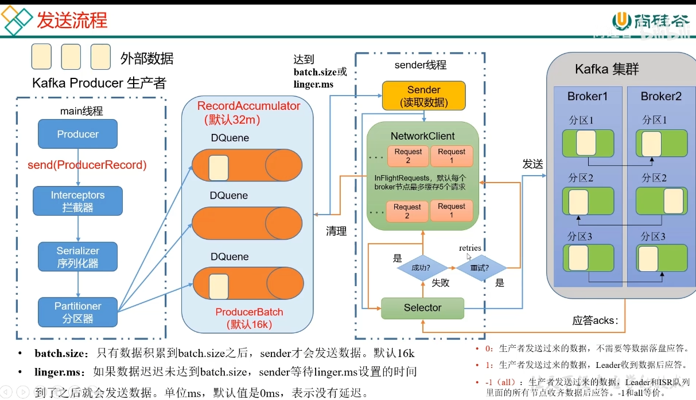

 # kafka

    producer  broker  consumer 
    topic  leader  follower

## 消息队列的两种模式
* 点对点
* 发布订阅（多个topic)

### 消息在 MQ 中的传递，大致可以归类为下面三种：
1、At most once: 至多一次。消息在传递时，最多会被送达一次。是不安全的，可能会丢数据。
2、At least once: 至少一次。消息在传递时，至少会被送达一次。也就是说，不允许丢消息，但是允许有少量重复消息出现。
3、Exactly once：恰好一次。消息在传递时，只会被送达一次，不允许丢失也不允许重复，这个是最高的等级。
大部分消息队列满足的都是At least once，也就是可以允许重复的消息出现。

## producer 

1. 拦截器，一般建议不用
2. 序列化器，自带的就行
3. 分区器
   1. 缓冲区：缓存双端队列，一个分区一个，默认32m；调整可增加吞吐量
   2. 批次大小，默认每个16k；调整可增加吞吐量
   3. sender线程等待时间，默认0ms；调整可增加吞吐量
   4. compression.type: snappy；数据压缩
4. sender线程：
   1. 拉取条件：达到批次大小 或者 超过等待时间
   2. 缓存队列：每个broker分区最多缓存5个client；（max.in.flight.requests.per.connection:其实可以超过5，为什么是5，见数据乱序)
   3. 应答acks机制（默认-1）：0，1，-1（是否等待数据落盘和副本数据落盘）
   4. 重试机制：次数：int最大值，不停的重试，直到成功
5. 异步发送&同步发送
   1. send()
   2. send(callback)
   3. send().get()
6. 分区策略（负载均衡、提高生产并发效率、提高消费效率）
   1. 默认分区策略（如果指定了分区，直接指定的分区；如果没有指定分区但是有key，hash分区；如果没有指定分区和key，粘性分区（随机选择分区，直到batch满了或已完成，再随机选择另一个分区））
   2. 自定义分区策略 implements Partitioner

## broker

1. controller&leader决定
   1. 默认第一个启动起来的controller为leader
   2. leader选举：ar先后顺序=broker启动先后顺序轮询选举；并且broker需要在isr中存货
2. 数据存储

## 消息可靠性
   1. ack机制：-1（all），副本必须落盘成功；0 异步，生产不能用；1：leader刷盘成功，用于普通日志，运行个别丢数据；
   2. isr机制：replica.lag.time.max.ms(默认30s)：
      * 和leader保持同步的follower+leader合集，如果follower长时间未向leader同步数据，则将该follower踢出isr;
   3. 副本数必须大于等于2，一个副本挂了，还有另一个副本在isr中
      1. replication.factor=N，设置一个比较大的值，保证至少有2个或者以上的副本。
      2. min.insync.replicas=N，代表消息如何才能被认为是写入成功，设置大于1的数，保证至少写入1个或者以上的副本才算写入消息成功。
      3. unclean.leader.election.enable=false，这个设置意味着没有完全同步的分区副本不能成为Leader副本，如果是true的话，那些没有完全同步Leader的副本成为Leader之后，就会有消息丢失的风险。
   4. retry次数>1
   5. broker减少刷盘间隔（非必须，-1机制保证了落盘成功）；page cache刷盘到磁盘的间隔一般是由操作系统决定的，所以如果没有刷盘之前宕机会造成消息丢失；
   6. 同步发送消息并callback保证消息发送成功
   7. producer在-1机制下副本同步成功后未应答时leader挂了，再次发送造成的消息重复；
      1. kafka 0.11版本后，增加了幂等性和事务，
      2. 幂等性：默认开启；只能保证单回话单分区内数据不重复；
      * producer不论向broker发送多少次重复数据，broker只会持久化一条，保证不重复
       判断标准： pid,partition,SeqNumber(pid:kafka每次重启生成，partition:分区号，Sequence Number:自增ID)
      3. kafka事务；
      * 开启事务必须开启幂等性；
      * producer使用事务前必须先自定义一个唯一的transactional.id；
      * 过程：
        * 通过事务ID%分区数定位到某一个分区的transactional coordinator事务协调器
        * 向事务协调器请求一个pid
        * 发送topic
        * 事务协调器记录本次事务：协调者设置事务的状态为PrepareCommit，写入到事务日志中
        * 事务协调器向broker发送commit请求
        * broker成功后数据落盘并标记事务成功（手动commit)
      * 代码实现手动事务提交
   8. consumer在当消费完消息后，还没来得及提交偏移量offset，系统就被关机了，那么未提交偏移量的消息则会再次被消费。自动提交默认是每5秒一次，这会导致重复消费或者丢失消息
      1. 关闭自动提交enable.auto.commit=false，消费者手动提交（同步提交或者异步提交）
      2. auto.offset.reset=earliest，这个参数代表没有偏移量可以提交或者broker上不存在偏移量的时候，消费者如何处理。earliest代表从分区的开始位置读取，可能会重复读取消息，但是不会丢失，消费方一般我们肯定要自己保证幂等，另外一种latest表示从分区末尾读取，那就会有概率丢失消息
      3. 消息下游处理重复
   9. 重平衡（消费者踢出、消费者增加）时有一定几率offset没提交，会导致重平衡后重复消费。
      1. 与重平衡相关的消费端参数：
        max.poll.interval.ms
        两次poll方法调用的最大间隔时间，单位毫秒，默认为5分钟。如果消费端在该间隔内没有发起poll操作，该消费者将被剔除，触发重平衡，将该消费者分配的队列分配给其他消费者。
        session.timeout.ms (当消费者消费的速度很慢、或者并发很大造成消费慢的时候，可能在一个session周期内还未完成消费。)
        消费者与broker的心跳超时时间,默认45s,老版本是10s;broker在指定时间内没有收到心跳请求，broker端将会将该消费者移出，并触发重平衡。
        heartbeat.interval.ms
        心跳间隔时间，消费者会以该频率向broker发送心跳，默认为3s，主要是确保session不会失效。

### 数据的有序和无序（消费者会同时消费多个分区的消息）
单分区内，有序；
多分区，分区与分区间无序；

### 数据乱序（sender缓存队列5个client同时发送时，中间的一个client发送失败）
* 未开启幂等性：设置sender缓存队列为1
* 开启幂等性：设置sender缓存队列小于5；
  * kafka1.x之后，启用幂等性后，kafka服务端会缓存producer发来的最近5个request的元数据，会在落盘前根据<pid,partition,SeqNumber>中的SeqNumber对request进行重排序

### kafka为什么快
1. 磁盘顺序读写
2. 零拷贝
3. 分区分段+索引 1G一个段并且每个段有index文件
4. 批量压缩
5. 批量读写
   1. 写可以批量写
   2. 读是一批消息发出去，处理了之后更改offset
6. 直接操作page cache而不是jvm，避免对象创建和GC，读写速度更高，进程重启缓存也不会丢失；log 刷盘;

### 线程安全问题
1. 生产者生产消息线程安全
2. 消费者消费消息不能使用多线程，offset提交问题

### kafka清除cleanup策略
Log.cleaner.enable=true 自动清理
log.cleanup.policy=delete / compact 删除或者压缩
两种删除条件：时间和大小 168小时等于一周 -1表示不限制
log.retention.hours=168 以及 log.retention.bytes=-1