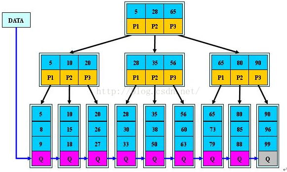
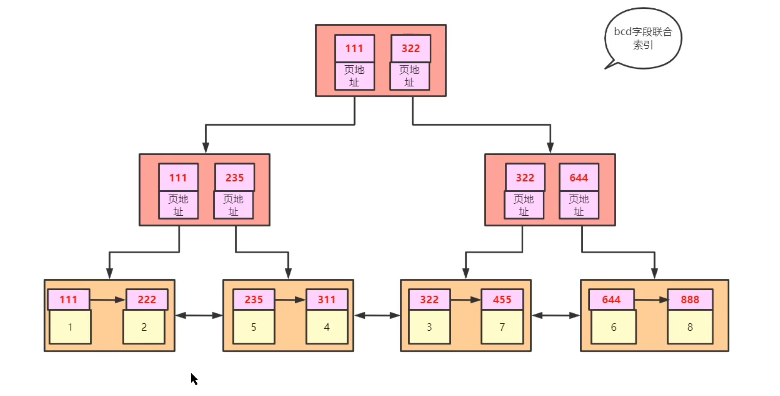

## 存储引擎

#### MyISAM

* 性能极佳，并且提供了大量特性，包括全文索引、压缩、空间函数等
* 不支持事务和行级锁
* 最大缺陷崩溃后无法安全恢复
* 不支持MVCC
* 不支持外键
* *不支持范围查找*

#### InnoDB

* 事务性数据库引擎
* 支持行级锁（row-level locking）和表级锁，默认行级锁
* 奔溃后安全恢复
* *支持MVCC*
* 支持外键

## 索引常见的数据结构

* 顺序查找
* 二叉树查找
* hash索引
* 二叉树， 红黑树（自平衡二叉查找树） 平衡过程太消耗I/O
* B-Tree
* B+Tree

## 影响索引查询效率的主要原因

1. 索引也是存在磁盘上的，需要的时候才读取到内存中
2. 磁盘I/O存取效率低。相对于内存，I/O存储的消耗要高几个数量级。所以索引的组织机构要尽力减少查找过程中的磁盘I/O存取次数，提升索引效率

## 一个B+Tree节点 = 4个物理page(innodb_page_size:16k)

* 磁盘往往不是按需读取，而是每次都会预读。即使只需要一个字节，磁盘也会从这个位置开始，顺序向后读取一定长度的数据放入内存。预读的长度一般为页（page:
  计算机管理存储器的逻辑块，通常为4k）的整数倍。当读的数据不在主存中，会触发一个缺页异常，此时系统会再次从数据的起始位置向后读取一页或几页载入内存中。
* 在计算机中磁盘存储数据最小单元是扇区，一个扇区的大小是512字节，而文件系统（例如XFS/EXT4）他的最小单元是块，一个块的大小是4k，而对于我们的InnoDB存储引擎也有自己的最小储存单元——页（Page），一个页的大小是16K。
* Mysql设计利用了磁盘预读原理，将一个b+tree节点大小设为一个页大小，在新建节点时直接申请一个页的控件，这样就能保证一个节点物理上存储在一个页里，加之计算机存储分配都是按页对其，这样就实现了每个Node节点只需要一次IO操作！
* 数据表中的数据都是存储在页中的。 假设一行数据的大小是1k，那么一个页可以存放16行这样的数据。
* 引申出一个优化： 一个行数据不应该大于一页大小，否则一个node放不下。
  

## 页 page

* mysql一页是16kb，操作系统一页一般是4kb
* 一页可以存放多条数据
* 一次io取的是一页数据，然后放入内存中; 以页为单位存放数据可以减少磁盘io
* 一个行数据不应该大于一页大小，否则一个node放不下。

### B+Tree索引

* 只有主键索引的叶子节点才存放的行数据
* 其他索引的叶子节点存放是是主键值
  

### 非数字字符转换成数字统统为0

* select 'a' = 0; -- 1
* select 'asd' = 0; -- 1
* select '123' = 123; -- 1

### 索引失效的情况，为什么没有利用索引进行查询

* 全表扫描更优：遍历操作 > 索引查找+多次回表io；
    * 查询了没有索引的字段导致回表；
    * 范围查找
    * not in / in / or / <> / is null / is not null 可能会导致；
    * 数据量太小；
    * 唯一性差；男女；
* 查询字段进行了类型转换或其他操作;
  * 包括隐式转换
    * 隐式类型转换：数据库是varchar传入是int的情况
    * 隐式字符编码转换：join 两表的时候，两表的字符集不同
* 不符合最左前缀原则；like '%xx%'；
