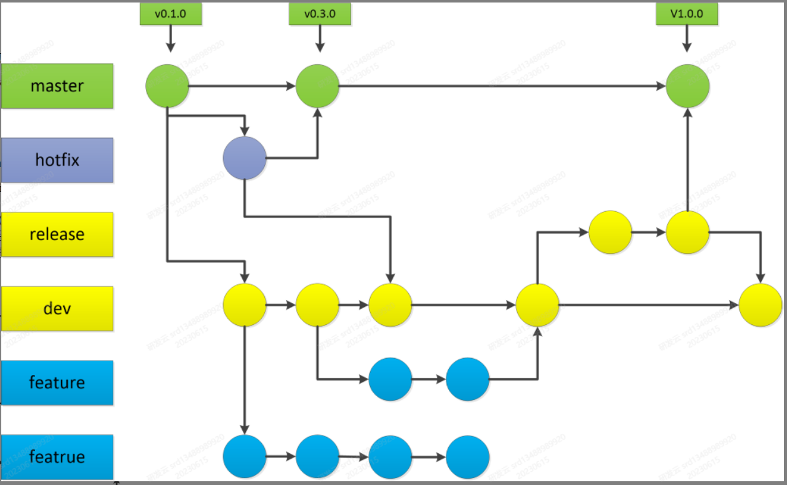

# 代码提交规范

### 提交前注意事项

在提交代码之前，必须先确认git config设置的用户名、邮箱和研发云注册的用户名、邮箱一致。
否则普通开发人员无法推送代码到研发云，而管理员虽然可以推送成功，却无法纳入度量统计。

1. 查看(git bash中才能使用grep)

`git config -l`

`git config -l | grep user`
2. 修改（最好是加global配置成全局的）

```
git config user.name <研发云用户名>
git config user.email <研发云用户邮箱>
```
3. 使用正确的分支

```
代码仓库分支
git代码仓库通常使用到master、dev、release、hotfix、feature五种分支，一般项目规划设计代码仓库时建议至少包括master、dev、release三个分支（研发云平台在创建代码仓库时默认创建这三个分支）：

master： 主/生产分支，与生产环境同步，最稳定的代码
dev： 开发分支，正在开发中的代码分支
release： 集成测试分支，来源于dev分支（一个的迭代计划的功能开发完成时），做集成测试，发布后合入master分支和dev分支
hotfix： 线上环境修复分支，来源于master，修复后合入master分支和dev分支；
feature： 特性开发分支，来源于dev分支进行功能特性开发，开发完成后合入dev分支。
bug: 修复分支，来源于dev，修复后合入dev分支

命名规范：
bug-bug号 
feature-功能号或迭代标识 
hotfix-bug号 
release-版本号

```

4. 提交关联工作项并填写正确的commit message

```
提交代码应与迭代开发任务关联，代码提交的commit message用以关联迭代开发任务或者需求，commit message须遵循以下格式：

type（scope） : subject

%workItemId

注意格式中的空格及符号

workItemId（可选）：工作项ID数字部分，以%号开头，空格结尾。可放置于提交日志中的任何位置。可支持多个ID串联，以%号间隔。如：%workItemId1%workItemId2
type（必选）：commit的类别，可使用以下标识：
    feat : 新功能
    fix : 修复bug
    docs : 文档改变
    style : 代码格式改变
    refactor : 某个已有功能重构
    perf : 性能优化
    test : 增加测试
    build : 改变了build工具 如 grunt换成了 npm
    revert : 撤销上一次的 commit
    chore : 构建过程或辅助工具的变动
scope（可选）：用于说明 commit 影响的范围，比如数据层、控制层、视图层等等，视项目不同而不同。
    subject（必选）：commit 的简短描述
commit示例：
最佳：
%1011 feat(登录)：A模块新增B功能
强制：
feat: A模块新增B功能
```
