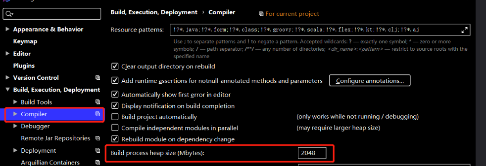
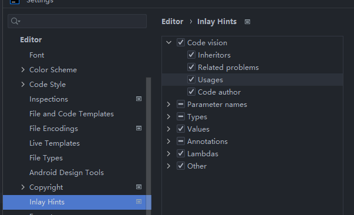

### source code does not match the bytecoe 
多版本残留造成的问题 1.show diff 拿到jar路径 2. 删除所有 3.重新导入

### 推荐字体 : dialog 

### 推荐theme : one dark theme

### console中文乱码
CMD support plugin插件造成的 禁用

### rainbow bracket
ctrl + 鼠标右键高亮大括号部分
alt + 鼠标右键淡化非大括号部分

### rainbow fart
程序猿鼓励师。。。

### Octotree - GitHub code tree & GitCodeTree

# writing classes build太慢

### 工具
* alibaba java coding guidelines(不更新了)
* Alibaba Java Coding Guidelines(XenoAmess TPM) 又名 p3c
* arthas idea
* maven helper
* mybatis x
* search everywhere api
* dark one
* grep console
* spring boot assistant

#### 显示usage数量
           

#### 不搜索log文件内容 
Idea系列：全局搜索(Find in Path)不搜索指定文件夹（如排除log文件）
File - Project Structure - Modules - 选择文件夹 - 右键Excluded

#### legalArgumentException: Malformed \uxxxx encoding.
https://blog.csdn.net/u012489412/article/details/132599950
删除mvn仓库中的依赖包，一般是项目自己打的依赖包出问题了