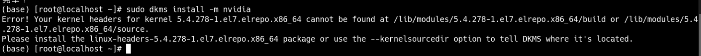

# redis压测：
./redis-benchmark -n 1000 -c 50 -d 102400 -r 1000 -t set,get -h 192.168.0.148 -p 16379 -a "cmdi..123" -q

# 升级系统软件
yum upgrade -y

# yum  rpmdb open failed
mv /var/lib/rpm/__db* /tmp;
rpm --rebuilddb;
yum clean all

# yum切换源

第1步：备份原有yum源：
mv /etc/yum.repos.d /etc/yum.repos.d.bak
第2步：创建yum源目录
mkdir /etc/yum.repos.d
第3步：下载阿里云yum源配置
wget -O /etc/yum.repos.d/CentOS-Base.repo http://mirrors.aliyun.com/repo/Centos-7.repo
第4步：重建yum缓存
yum clean all
yum makecache

# yum工具
安装yum-utils
yum install yum-utils
清理未完成事务
yum-complete-transaction --cleanup-only

# yum重装
uname -r

rpm -qa | grep yum | xargs rpm -e --nodeps
rpm -qa yum

```
wget http://mirror.centos.org/centos/7/os/x86_64/Packages/yum-3.4.3-168.el7.centos.noarch.rpm
wget http://mirror.centos.org/centos/7/os/x86_64/Packages/yum-metadata-parser-1.1.4-10.el7.x86_64.rpm
wget http://mirror.centos.org/centos/7/os/x86_64/Packages/yum-plugin-fastestmirror-1.1.31-54.el7_8.noarch.rpm
```

rpm -ivh yum-* 

rpm -qa yum


## npm 安装
1. wget https://nodejs.org/dist/v16.9.1/node-v16.9.1-linux-x64.tar.gz
2. tar -vxzf
3. ln -s ~/node-v16.9.1-linux-x64/bin/npm /usr/local/bin/npm
4. ln -s ~/node-v16.9.1-linux-x64/bin/node /usr/local/bin/node


# 切换yum源 All mirrors were tried
1. x
cd /etc/yum.repos.d/
2. x
rm *.repo
3. 选择版本 cat /etc/centos-release 查看版本
wget -O /etc/yum.repos.d/CentOS-Base.repo https://mirrors.aliyun.com/repo/Centos-8.repo
wget -O /etc/yum.repos.d/CentOS-Base.repo http://mirrors.aliyun.com/repo/Centos-7.repo
4. 重建缓存
   yum clean all
   yum makecache

5. 升级所有包
   yum upgrade -y
   yum -y update：升级所有包同时，也升级软件和系统内核；（时间比较久）
   yum -y upgrade：只升级所有包，不升级软件和系统内核，软件和内核保持原样


## 修改文件数（连接数）
* 方法1：ulimit -n 65535
* 方法2：
```
vim /etc/security/limits.conf

* hard nofile 20000
* soft nofile 15000
* soft nproc 65535
* hard nproc 65535

```


## kernel升级 先切换源
1. 查看当前系统内核版本，可升级的内核版本
  yum info kernel -q 
2. 升级当前版本支持的内核版本信息
  yum update kernel
3. 查看当前已经安装的内核版本情况
  yum list kernel
4. 系统重启后默认选择最高版本kernel
  reboot
5. 查看当前系统内核
  uname -a
  uname -sr

## 指定源安装
* 删除旧配置（可选）
sudo rpm -e elrepo-release
* 安装 ElRepo 仓库
sudo rpm -Uvh https://www.elrepo.org/elrepo-release-7.el7.elrepo.noarch.rpm
* 启用 kernel 仓库
sudo sed -i 's/enabled=0/enabled=1/g' /etc/yum.repos.d/elrepo.repo
* 清理缓存并重新搜索：
sudo yum clean all
sudo yum --disablerepo=* --enablerepo=elrepo-kernel list kernel-lt*
* 安装
yum --disablerepo=* --enablerepo=elrepo-kernel update -y


/usr/src/kernels没有相应的头文件 导致显卡驱动无法安装

https://www.cnblogs.com/Leonardo-li/p/18672492

```
kernel-lt-5.4.278-1.el7.elrepo.x86_64.rpm
描述：这是核心内核包，包含了所有的内核功能和驱动程序。
作用：升级内核本身，提供系统的基础功能。

kernel-lt-devel-5.4.278-1.el7.elrepo.x86_64.rpm
描述：内核开发包，包含构建内核模块所需的头文件和开发文件。
作用：用于编译和安装第三方内核模块（例如 NVIDIA 驱动、VirtualBox 等）。

kernel-lt-headers-5.4.278-1.el7.elrepo.x86_64.rpm
描述：内核头文件包，提供与内核交互的 API 和结构体。
作用：主要用于开发需要与内核交互的用户空间程序。

kernel-lt-doc-5.4.278-1.el7.elrepo.noarch.rpm (可选)
描述：内核文档包，提供内核开发和配置的详细文档。
作用：帮助开发者理解内核的工作原理和配置方法。

kernel-lt-tools-5.4.278-1.el7.elrepo.x86_64.rpm
描述：内核工具包，提供内核相关的工具，如 cpupower 等。
作用：用于内核的调试、监控和管理。

kernel-lt-tools-libs-5.4.278-1.el7.elrepo.x86_64.rpm
描述：为内核工具包提供库文件。
作用：支持内核工具的运行。

kernel-lt-tools-libs-devel-5.4.278-1.el7.elrepo.x86_64.rpm
描述：内核工具库开发包。
作用：用于开发与内核工具交互的程序或模块。
```


## 定时任务配置 vim /etc/crontab

```

# For details see man 4 crontabs

# Example of job definition:
# .---------------- minute (0 - 59)
# |  .------------- hour (0 - 23)
# |  |  .---------- day of month (1 - 31)
# |  |  |  .------- month (1 - 12) OR jan,feb,mar,apr ...
# |  |  |  |  .---- day of week (0 - 6) (Sunday=0 or 7) OR sun,mon,tue,wed,thu,fri,sat
# |  |  |  |  |
# *  *  *  *  * user-name  command to be executed

# 每天凌晨2.20清理无用的docker镜像
20 2 * * * echo y | docker image prune -a

```


## 磁盘分区操作

在线扩容使用 resize2fs或xfs_growfs 对挂载目录在线扩容
resize2fs 针对文件系统ext2 ext3 ext4
* resize2fs /dev/sda4 80G -p 更改分区大小到80G 去掉80G表示更改到最大
xfs_growfs 针对文件系统xfs
* xfs_growfs /dev/sda3
parted
* resizepart 3 380G


# 文件导入
apt install lrzsz
rz-be